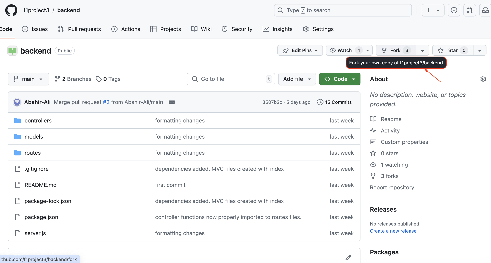
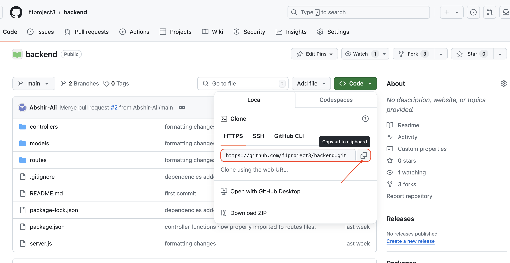
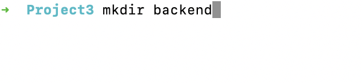
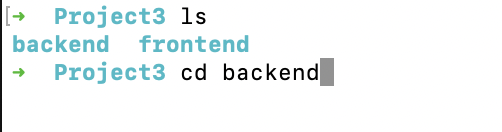
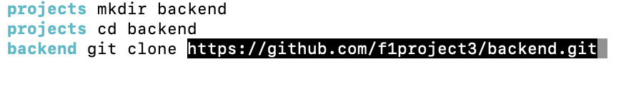
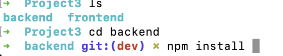
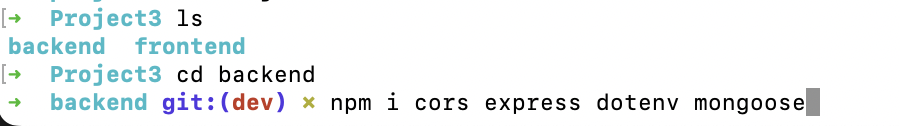
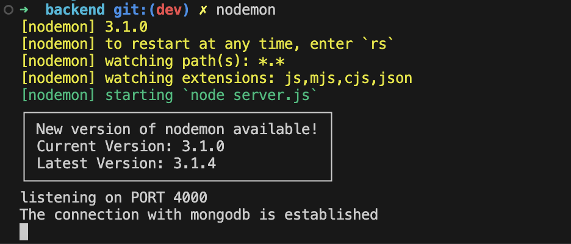

# F1 App - Backend

#### The backend of a full-stack application built as Project 3, a group project.

## DESCRIPTION 
F1 App - Backend is one half of the F1 application designed to allow F1 fans to learn more about their favorite F1 teams and drivers. 

## TABLE OF CONTENTS
* [Technologies Used](#technologiesused)
* [Features](#features)
* [Project Management](#projectmanagement)
* [Installation Instructions/Getting Started](#installation-instructionsgetting-started)
* [Deployed Backend](#deployedbackend)

## TECHNOLOGIES USED: 
* HTML5 
* JavaScript 
* Express 
* Node 
* Mongoose

## FEATURES
* Users can create, read, update, or destroy items from the working JSON API 

## INSTALLATION INSTRUCTIONS/GETTING STARTED
* Fork the Backend Repository 

 

* Copy that Repository code 

* In Terminal, mkdir a directory for your code (**Hint**: it can be called backend)

 

* CD into your directory

   

* Clone the Repository to your local machine by typing git clone (+url) and hit enter 

 

* Once the repository has been cloned, cd into it and `npm install` to download all dependencies

 
 
* This should download any and all dependencies affliated with the file, however, if it does not, `npm i` the following dependencies: 
        - cors 
        - express 
        - dotenv 
        - mongoose

 

* Create a .env file and add the port listed in the DriverList.jsx file housed in the Frontend repository.
* Once created, start the server by typing `nodemon` into the IDE's terminal 
* A working server will feature a messsage such as the example below: 

 

## DEPLOYED BACKEND
The Backend of the F1 App can be accessed via this link: [https://backend-esrb.onrender.com](https://backend-esrb.onrender.com)
